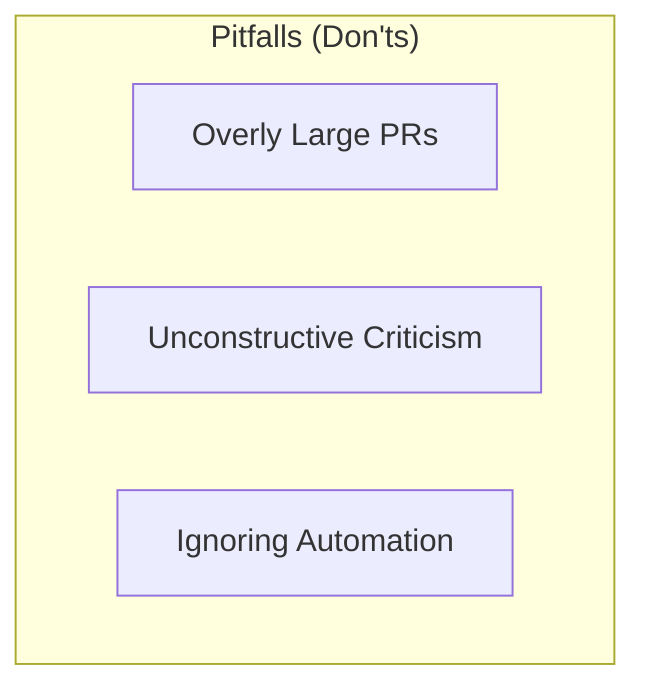
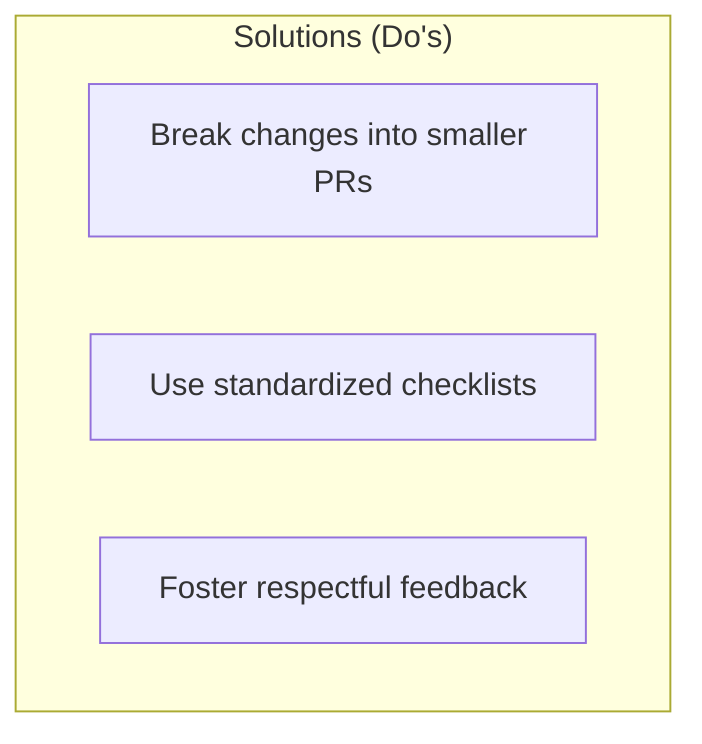
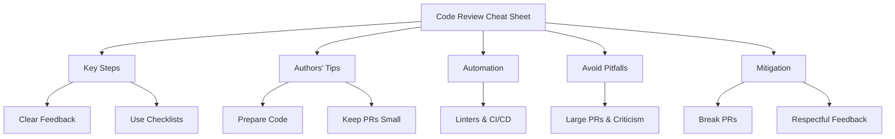

---

# Introduction


- Task estimation, 
- Code reviews, 
- Debugging techniques


---

## Document Structure


### **1. Task Estimation in Scrum**


### **2. Code Reviews**


### **3. Effective Debugging & Bug Tracking**


### **4. Appendices & References**


---

## Repository Structure


---

# Project Plan: Software Quality Handbook

## **1. Project Overview**


- **Task Estimation in Scrum**
- **Code Reviews**
- **Effective Debugging & Bug Tracking**


## **2. Team Roles**


## **3. Timeline & Task Breakdown**

### **Phase 1: Setup & Planning**

- **OA**: Create GitHub repository, set up structure  
- **FT & JN**: Define & commit project plan  

### **Phase 2: Research**

- **FT & JO**: Research Task Estimation (Find 5 sources)  
- **JN & OA**: Research Code Reviews (Find 5 sources)  
- **JO & FT**: Research Debugging & Bug Tracking (Find 5 sources)  

### **Phase 3: Drafting**

- **FT & JO**: Write Task Estimation section  
- **JN & OA**: Write Code Reviews section  
- **JO & FT**: Write Debugging & Bug Tracking section  
- **OA**: Write Introduction & document structure  

### **Phase 4: Review & Revisions**

- **OA & JN**: Review Task Estimation  
- **FT & JO**: Review Debugging & Bug Tracking  

### **Phase 5: Finalisation**

- **OA & FT**: Standardise formatting & diagrams  
- **FT & JO**: Conduct final review & edits  
- **OA**: Submit final version & GitHub repository


---

# Task Estimation in Scrum 

---

## **1. Overview & Importance**  
- Task estimation is a critical process in Scrum that allows teams to predict effort, allocate resources effectively, and ensure a balanced workload.
- Without proper estimation, teams may struggle with missed deadlines, overworked developers, and uncontrolled scope creep. Proper task estimation enables better sprint planning, leading to predictable and efficient development cycles.
- For example, as discussed in **[Stories and Task Estimation](https://www.reddit.com/r/scrum/comments/18bbr88/stories_and_task_estimation/)**, teams that implemented structured estimation techniques saw a reduction in last-minute changes and improved sprint predictability.  

---

## **2. Key Guidelines for Effective Estimation**

**Define Clear Estimation Criteria** 
- Teams should establish a shared understanding of effort levels for different tasks. Using consistent criteria helps standardize estimation across different team members.

**Encourage Team Collaboration**  
- Estimation should be a collaborative effort involving all team members. Diverse perspectives lead to more accurate estimations, reducing the risk of underestimation or overestimation.

**Review & Improve Estimates Continuously** 
- Compare previous estimates with actual completion times to improve future accuracy.

**Select the Right Estimation Method** 
- Choose estimation techniques that fit the complexity of the task.  


  

  ***Source** **[Tips for more accurate Estimating Sessions](https://softwaredevtools.com/blog/tips-for-effective-estimating-sessions/)***

---

## **3. Different Types of Estimation**


**Consensus-Based Estimation:**
  - **Planning Poker** – A collaborative estimation technique where team members assign story points based on discussion and consensus.
  
**Relative Sizing:**
  - **T-Shirt Sizing** – Categorises tasks into sizes like XS, S, M, L, XL for quick estimation.
  - **Affinity Estimation** – Groups tasks based on similarities in effort, allowing teams to estimate large backlogs efficiently.
  
**Work Breakdown Approach:**
  - **Breaking Down Large Tasks** – Dividing large user stories into smaller tasks improves accuracy and reduces ambiguity in estimation.  


 ```mermaid
graph TD;
    A[Task Estimation Methods] --> B[Consensus-Based Estimation]
    B --> C[Planning Poker]
    A --> D[Relative Sizing]
    D --> E[T-Shirt Sizing]
    D --> F[Affinity Estimation]
    A --> G[Work Breakdown Approach]
    G --> H[Breaking Down Large Tasks]

    %% Styling for better readability
    classDef mainNode fill:#f4b400,stroke:#000,stroke-width:2px;
    classDef subNode fill:#34a853,stroke:#000,stroke-width:1px;
    classDef method fill:#4285f4,stroke:#000,stroke-width:1px;

    class A mainNode;
    class B,D,G subNode;
    class C,E,F,H method;
```
---

## **4. Strategies to Improve Estimation Accuracy**
- **Include Risk Factors** – Consider complexity, dependencies, and uncertainties in estimations.
- **Timebox Estimation Discussions** – Avoid overanalysing estimates to keep the process efficient.
- **Run Post-Sprint Reviews** – Discuss estimation accuracy after sprints to refine future estimates.

---

## **5. Common Mistakes & Bad Practices**  


**Over-Estimating to Be Safe** – Excessive padding can lead to inefficiencies, resulting in wasted time and resources. 

**Underestimating Task Complexity** – Failing to account for hidden complexities can lead to unfinished sprints, technical debt, and missed deadlines.

**Lack of Iterative Improvement** – Not refining estimation techniques results in persistent inaccuracies.  


[](https://www.youtube.com/watch?v=oZGqldCqh8E)

*Source: [8 Horrible Mistakes with Estimation (Agile Scrum)](https://www.youtube.com/watch?v=oZGqldCqh8E)*
---

## **6. Tools & Techniques for Estimation**  
- **JIRA & Confluence** – Track past sprint estimations and improve future ones.  
- **GitHub Issues & Story Points** – Assign and review estimations for accuracy.  

---

## **7. Quick Reference Summary**  
- Involve **the whole team** in estimation discussions.  
- Avoid **common pitfalls like underestimating complexity and ignoring risk factors**.  

---

## **8. Conclusion & Next Steps**  
- Task estimation is an iterative process that improves over time.  
- Teams should regularly **review and adjust their estimation methods** to match real project timelines.  

---

## **9. References/ Further Reading**  


---

# Code Reviews

**Purpose:**
- To define what code reviews are.
- Why they're important for everyone.
- To give practical and functional guidelines for both reviewers and authors.

**Goal:**
- To improve code quality.
- To increase the knowledge on Code reviewers.
- Promote a more positive collaborative culture.

---

## 1. Overview & Benefits

**What are code reviews?**
- Code reviews is a process that examines any code changes that are made before merging into the main branch.
- It focus on improving the quality of the code, catching any problems early and sharing experience with your team.

**Key Benefits:**
- Enhanced Quality: This helps identify bugs, improve the codes readability and ensure consistency.
- Collaboration: Creates a mutual learning and shared code ownership.
- Issue detection: Allows the team to catch any defects before they send a product out for production for example.

    ```mermaid
    graph TD;
        A[Developer Submits Pull Request] -->|Automated Tests Run| B{Tests Pass?};
        B -- No --> C[Fix Issues and Resubmit];
        B -- Yes --> D[Peer Code Review];
        D -->|Review Passed?| E{Approved?};
        E -- No --> F[Provide Feedback & Request Changes];
        F --> A;
        E -- Yes --> G[Merge to Main Branch];
        G --> H[Deployment & Monitoring];
        
        subgraph Benefits of Code Reviews
            I[Improves Code Quality] 
            J[Encourages Collaboration]
            K[Detects Issues Early]
            L[Ensures Consistency]
            M[Knowledge Sharing]
        end

        G -->|Code is Merged| I & J & K & L & M;

---

## 2. Best Practices for Reviewers
*Aim: Provide a clear guideline for any team to ensure constructive and efficient reviews.*

**Delivery & Feedback:**
- Be respectful and focus on only the code not the person coding. 
- Make sure the questions being asked are precise and clarifying to read and understand.

**Guidelines:**
- Point out the exact area that are needed for improvement.
- Explain why they need to make the change.
- Give effective solutions and clean code.

**Reviewers Checklist:**
- Is the code clear and understandable?
- Are the tests comprehensible?
- Does the code follow the standard set?
- Are there any issues with security or performance?

---

## 3. Best Practices for Code Authors
*Aim: Equip authors with pratical steps to prepare their code for a steady review process.*

**Preparation**
- Reviewing own work for any issues before submitting.
- Reduce the size of large features into smaller pull requests.
- Add detailed descriptions and contexts about the pull request.

**Engagement**
- Be open to feedback and ask questions.
- Update any relevant documentation and tests as needed.

**Do's**
- Write a clear commit message.
- Update relevant documentation.

**Dont's**
- Submit huge changes that have no aim.

---

## 4. Tools and Automation  
*Aim: Leverage automation to streamline the code review process and focus human effort on high-level analysis.*

**Why Automate?**  
- Handle trivial issues like formatting, linting, and simple syntax errors automatically.

**Recommended Tools:**  
- **Linters and Formatters:** Ensure consistent code style.  
- **CI/CD Pipelines:** Run tests and static analysis before manual review.

**Integration Tips:**  
- Set up pre-review automation to catch low-level issues.
- Focus human review on logic, design, and potential risks.


**CI/CD Pipeline Dashboard Example:**  
  
*Caption:* CI/CD pipeline dashboard displaying build status and test results.

---

## 5. Common Pitfalls & Mitigation Strategies  
*Aim: Identify challenges and provide actionable tips to overcome them.*

**Pitfalls to Avoid:**  
- **Overly Large Pull Requests:** Difficult to review thoroughly.  
- **Unconstructive Criticism:** Personal or vague comments that hinder progress.
- **Ignoring Automation:** Manually reviewing issues that tools can catch.



**Mitigation Strategies:**  
- Break changes into smaller, focused PRs.
- Use standardized checklists to maintain objectivity.
- Encourage a culture of respectful feedback and continuous learning.



---

## 6. Quick Reference Summary  
*Aim: Provide a concise, one-page summary for rapid recall.*

**Key Takeaways:**  
- **For Reviewers:** Use clear, respectful, and actionable feedback.  
- **For Authors:** Prepare well, keep changes small, and be open to suggestions.  
- **Automation is Key:** Utilize tools to handle routine checks.
  
**Visual Summary:**  


*Caption:* A concise visual cheatsheet for rapid recall for good code reviews practices.

---

## 7. Conclusion & Next Steps  
- **Wrap-Up:**  
- Recap the benefits and essential guidelines for effective code reviews.

**Action Items:**  
- Integrate checklists and automation into your current workflow.
- Schedule a team meeting to discuss and refine these practices.

**Visual Overview:**  

*Caption:* A concise roadmap for implementing effective code review practices.

---

## 8. References


1. **[How to Make Good Code Reviews Better](https://stackoverflow.blog/2019/09/30/how-to-make-good-code-reviews-better/)** – Stack Overflow Blog (2019)

2. **[Code Review Best Practices. How to make people like your code review?](https://tsh.io/blog/code-review-best-practices/#:~:text=Reviewing%20the%20code%20means%20one,personal%20code%20review%20best%20practices)** – Marcin Gajda (The Software House blog, 2020)

3. **[Code Review Guidelines for Humans](https://phauer.com/2018/code-review-guidelines/#:~:text=Code%20reviews%20are%20powerful%20means,effective%20and%20respectful%20code%20review)** – Philipp Hauer’s Blog (2022)

4. **[Code Review Best Practices](https://blog.palantir.com/code-review-best-practices-19e02780015f?gi=2c7d3ff9542a#:~:text=,adds%20implementations%20for%20those%20interfaces)** – Palantir Engineering Blog (2018)

5. **[5 Best Practices for Code Reviews](https://www.codelantis.com/blog/code-reviews-best-practices)** – Codelantis Blog (2023)


---

# Debugging & Bug Tracking

## 1. Overview & Importance

---

## 2. Best Practices for Debugging

---

## 3. Best Practices for Bug Tracking

---

## 4. Debugging & Bug Tracking Tools

---

## 5. Common Mistakes & Bad Practices

---

## 6. Debugging & Bug Resolution Workflow (Diagram)

---

## 7. Quick Reference Summary

---

## 8. Conclusion & Next Steps

---

## 9. References/Further Reading
1. [Some Ways to Get Better at Debugging – Julia Evans](https://jvns.ca/blog/2022/08/30/a-way-to-categorize-debugging-skills/) – A personal breakdown of debugging skills, how to improve systematically, and real-world debugging techniques.

2. [18 Lessons from 13 Years of Tricky Bugs – Henrik Warne](https://henrikwarne.com/2016/06/16/18-lessons-from-13-years-of-tricky-bugs/) – Hard-earned debugging lessons from a veteran developer, covering debugging mistakes and best practices.

3. [Painless Bug Tracking – Joel Spolsky](https://joelonsoftware.com/2000/11/08/painless-bug-tracking/) – A classic guide on how teams should track and manage bugs efficiently.

4. [Best Practices for Effective Bug Reporting – Bugasura Blog](https://bugasura.io/blog/best-practices-for-effective-bug-reporting-in-bug-tracking-systems/) – Detailed guide on writing clear, actionable bug reports to speed up debugging.

5. [Agile: Dealing with Your Bug Backlog – Steve Novoselac](https://stevenovoselac.com/2011/11/28/agile-dealing-with-your-bug-backlog/) – Practical tips on managing bug backlogs in an agile development workflow.
