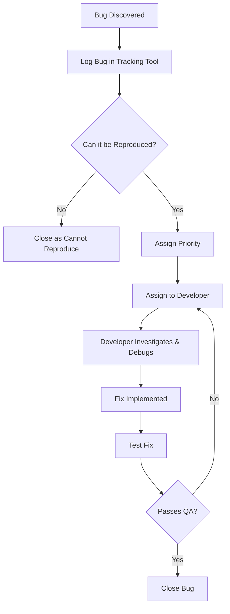

# Debugging & Bug Tracking

## 1. Overview & Importance

---

## 2. Best Practices for Debugging

---

## 3. Best Practices for Bug Tracking

---

## 4. Debugging & Bug Tracking Tools

---

## 5. Common Mistakes & Bad Practices

---

## 6. Debugging & Bug Resolution Workflow (Diagram)

See [this real GitHub issue](https://github.com/facebook/react/issues/15336) in React's repo for a practical example of a bug progressing from report to triage and resolution.

  
Example Workflow Scenarios

  - A user reports a crash during form submission.
  - The dev team reproduces it and discovers a missing null check.
  - A hotfix is developed and deployed, then tracked as "resolved" in the issue tracker.

---

## 7. Quick Reference Summary

**Use this standardised bug report template:**  
[Sample Bug Report Template on GitHub Gist](https://gist.github.com/colmarius/a62ba4854b23099ce3654357bf2fa68d)

This cheat-sheet summarises the essentials of debugging and bug tracking for fast decision-making:

| ✅ Do                                         | ❌ Avoid                            |
| -------------------------------------------- | ------------------------------------- |
| Reproduce the bug before fixing              | Guessing without reproduction         |
| Write clear, concise bug reports             | Fixing without testing                |
| Tag bugs by severity and priority            | Combining multiple bugs in one report |
| Use logs and debuggers for investigation     | Letting old bugs sit in the backlog   |
| Test thoroughly after every fix              | Skipping triage or assignment         |
| Track bugs in JIRA, GitHub Issues, or Linear |                                       |

---

## 8. Conclusion & Next Steps

Debugging and bug tracking are crucial for **software stability**, **user trust**, and **developer efficiency**. By adopting structured workflows, teams can resolve issues faster and prevent the same bugs from reoccurring.

To take this further:
- **Educate**: Ensure every team member knows how to write and triage a bug report.
- **Integrate**: Link your tracking tools with the dev environment.
- **Define SLAs**: Set fix-time targets for critical bugs.
- **Tidy Backlog**: Regularly revisit the backlog to reduce tech debt.
- **Review Often**: Reflect on debugging practices during retrospectives.

These practices will help your team **scale quality alongside speed**.

 – *Watch this walkthrough of how a bug triage meeting is conducted and learn how to prioritise, assign, and manage reported issues.*

### Team Implementation Checklist
- [ ] Everyone understands the bug resolution workflow.  
- [ ] Debugging tools are set up across environments.  
- [ ] Bug triage meetings are scheduled weekly.  
- [ ] Bug report template is adopted in the issue tracker. 

---

## 9. References/Further Reading
1. [Some Ways to Get Better at Debugging – Julia Evans](https://jvns.ca/blog/2022/08/30/a-way-to-categorize-debugging-skills/) – A personal breakdown of debugging skills, how to improve systematically, and real-world debugging techniques.

2. [18 Lessons from 13 Years of Tricky Bugs – Henrik Warne](https://henrikwarne.com/2016/06/16/18-lessons-from-13-years-of-tricky-bugs/) – Hard-earned debugging lessons from a veteran developer, covering debugging mistakes and best practices.

3. [Painless Bug Tracking – Joel Spolsky](https://joelonsoftware.com/2000/11/08/painless-bug-tracking/) – A classic guide on how teams should track and manage bugs efficiently.

4. [Best Practices for Effective Bug Reporting – Bugasura Blog](https://bugasura.io/blog/best-practices-for-effective-bug-reporting-in-bug-tracking-systems/) – Detailed guide on writing clear, actionable bug reports to speed up debugging.

5. [Agile: Dealing with Your Bug Backlog – Steve Novoselac](https://stevenovoselac.com/2011/11/28/agile-dealing-with-your-bug-backlog/) – Practical tips on managing bug backlogs in an agile development workflow.
