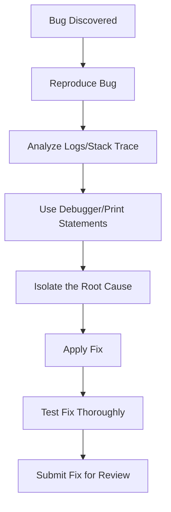
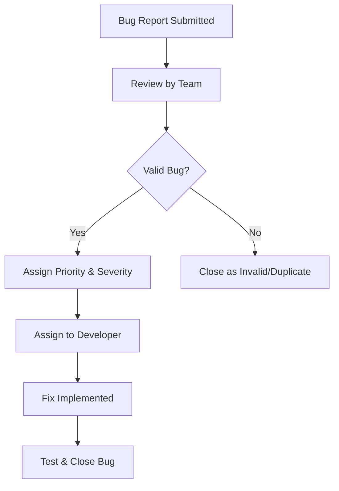
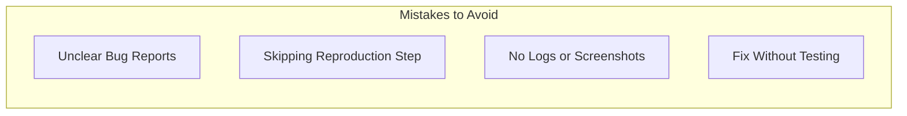
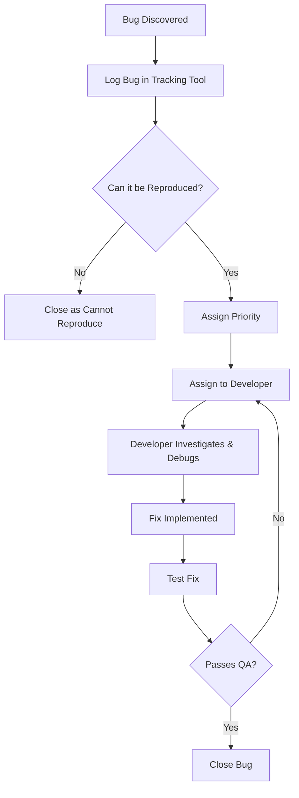

# Debugging & Bug Tracking

## 1. Overview & Importance

- Debugging and bug tracking are core parts of maintaining high software quality in fast-paced development environments. Debugging involves identifying, isolating, and resolving defects in code, while bug tracking provides a structured way to report, prioritize, and monitor those defects over time.

- Without proper debugging and tracking, defects often slip into production, causing user frustration, reduced trust, and delays in development. Implementing solid practices in these areas leads to faster issue resolution, clearer team communication, and more stable releases.

---

## 2. Best Practices for Debugging

**Systematic and effective debugging can dramatically reduce resolution time. Here are key practices:**

- **Always Reproduce the Bug First:** If you can’t reproduce it, you can’t fix it. Ensure the issue is consistently occurring.
- **Use Logging and Stack Traces:** Logs and stack traces offer vital insight into runtime issues. Ensure logs are clean, useful, and easy to search.
- **Leverage Debugging Tools:** Use built-in IDE tools or browser debuggers (e.g., Chrome DevTools, VS Code debugger) to step through code.
- **Change One Variable at a Time:** Avoid making multiple fixes at once—it makes it harder to identify the root cause.
- **Pair Programming / Rubber Ducking:** Explaining the issue to a teammate (or even an inanimate object) often helps reveal overlooked clues.

---

## 3. Best Practices for Bug Tracking

**Effective bug tracking ensures transparency, accountability, and prioritization.**

- **Write Clear and Concise Reports:** Include the issue summary, reproduction steps, expected vs. actual results, environment info, and screenshots/logs.
- **Tag Severity and Priority:** Categorize bugs by how critical they are (e.g., Critical, High, Medium, Low).
- **Triage Regularly:** Host bug triage meetings to reassess priorities, close outdated issues, and assign new bugs.
- **Link to Related Work:** Connect bug tickets to relevant commits, pull requests, or documentation.
- **One Issue per Report:** Avoid combining multiple bugs in one ticket—it complicates tracking and fixing.

---

## 4. Debugging & Bug Tracking Tools

**Popular tools to enhance your debugging and tracking process:**

### Debugging Tools:
- **Chrome DevTools** – Frontend debugging in the browser.
- **VS Code Debugger** – Step through server/client code.
- **Xcode/Android Studio** – Mobile debugging with breakpoints and logs.

### Bug Tracking Tools:
- **JIRA** – Robust tracking with sprint integration.
- **GitHub Issues** – Lightweight and integrated with repositories.
- **Linear** – Modern, fast bug/issue tracker with clean UX.

**Tips:**
- Use bug report templates to maintain consistency.
- Integrate tools with Slack or email for updates.

---

## 5. Common Mistakes & Bad Practices

Avoid these frequent pitfalls when debugging or tracking bugs:

- **Unclear Bug Reports:** Lack of context wastes time.
- **Not Reproducing the Bug:** Leads to guesswork and improper fixes.
- **No Supporting Evidence:** Logs or screenshots can often speed up resolution.
- **Fixing Without Testing:** Risk of regressions or incomplete fixes.
- **Ignoring Bug Backlogs:** Technical debt increases when bugs are left unresolved.

---

## 6. Debugging & Bug Resolution Workflow (Diagram)

See [this real GitHub issue](https://github.com/facebook/react/issues/15336) in React's repo for a practical example of a bug progressing from report to triage and resolution.

  
Example Workflow Scenarios

  - A user reports a crash during form submission.
  - The dev team reproduces it and discovers a missing null check.
  - A hotfix is developed and deployed, then tracked as "resolved" in the issue tracker.

---

## 7. Quick Reference Summary

**Use this standardised bug report template:**  
[Sample Bug Report Template on GitHub Gist](https://gist.github.com/colmarius/a62ba4854b23099ce3654357bf2fa68d)

This cheat-sheet summarises the essentials of debugging and bug tracking for fast decision-making:

| ✅ Do                                         | ❌ Avoid                            |
| -------------------------------------------- | ------------------------------------- |
| Reproduce the bug before fixing              | Guessing without reproduction         |
| Write clear, concise bug reports             | Fixing without testing                |
| Tag bugs by severity and priority            | Combining multiple bugs in one report |
| Use logs and debuggers for investigation     | Letting old bugs sit in the backlog   |
| Test thoroughly after every fix              | Skipping triage or assignment         |
| Track bugs in JIRA, GitHub Issues, or Linear |                                       |

---

## 8. Conclusion & Next Steps

Debugging and bug tracking are crucial for **software stability**, **user trust**, and **developer efficiency**. By adopting structured workflows, teams can resolve issues faster and prevent the same bugs from reoccurring.

To take this further:
- **Educate**: Ensure every team member knows how to write and triage a bug report.
- **Integrate**: Link your tracking tools with the dev environment.
- **Define SLAs**: Set fix-time targets for critical bugs.
- **Tidy Backlog**: Regularly revisit the backlog to reduce tech debt.
- **Review Often**: Reflect on debugging practices during retrospectives.

These practices will help your team **scale quality alongside speed**.

 – *Watch this walkthrough of how a bug triage meeting is conducted and learn how to prioritise, assign, and manage reported issues.*

### Team Implementation Checklist
- [ ] Everyone understands the bug resolution workflow.  
- [ ] Debugging tools are set up across environments.  
- [ ] Bug triage meetings are scheduled weekly.  
- [ ] Bug report template is adopted in the issue tracker. 

---

## 9. References/Further Reading
1. [Some Ways to Get Better at Debugging – Julia Evans](https://jvns.ca/blog/2022/08/30/a-way-to-categorize-debugging-skills/) – A personal breakdown of debugging skills, how to improve systematically, and real-world debugging techniques.

2. [18 Lessons from 13 Years of Tricky Bugs – Henrik Warne](https://henrikwarne.com/2016/06/16/18-lessons-from-13-years-of-tricky-bugs/) – Hard-earned debugging lessons from a veteran developer, covering debugging mistakes and best practices.

3. [Painless Bug Tracking – Joel Spolsky](https://joelonsoftware.com/2000/11/08/painless-bug-tracking/) – A classic guide on how teams should track and manage bugs efficiently.

4. [Best Practices for Effective Bug Reporting – Bugasura Blog](https://bugasura.io/blog/best-practices-for-effective-bug-reporting-in-bug-tracking-systems/) – Detailed guide on writing clear, actionable bug reports to speed up debugging.

5. [Agile: Dealing with Your Bug Backlog – Steve Novoselac](https://stevenovoselac.com/2011/11/28/agile-dealing-with-your-bug-backlog/) – Practical tips on managing bug backlogs in an agile development workflow.
